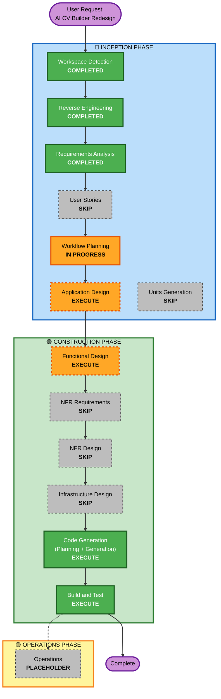

# Execution Plan: AI CV Builder Redesign

## Detailed Analysis Summary

### Transformation Scope (Brownfield)
- **Transformation Type**: Frontend Enhancement - Major UI/UX redesign with new pages and multi-step flow
- **Primary Changes**: 
  - Create 4 new/enhanced pages (landing, multi-step form, template selection, final resume)
  - Implement 3 distinct resume templates
  - Add premium UI/UX with smooth transitions and responsive design
- **Related Components**: 
  - Templates: index.html (modify), view.html (complete rewrite), landing.html (new), template-selection.html (new), 3 template files (new)
  - CSS: style.css (major updates), print.css (updates)
  - JavaScript: form.js (enhance), form-wizard.js (new), template-preview.js (new)
  - Backend: app.py (add new routes), database.py (optional schema additions)

### Change Impact Assessment
- **User-facing changes**: **YES** - Complete redesign of user experience with new flow (landing → multi-step form → template selection → final resume)
- **Structural changes**: **NO** - Backend architecture remains unchanged (MVC pattern, Flask + SQLite)
- **Data model changes**: **MINIMAL** - Optional fields only (template_choice, summary) - backward compatible
- **API changes**: **MINIMAL** - New routes added (GET /landing, GET /select-template, POST /save-template), existing routes unchanged
- **NFR impact**: **YES** - Enhanced performance (smooth transitions), improved usability (multi-step wizard), better accessibility (semantic HTML, ARIA)

### Component Relationships (Brownfield)
```
Primary Component: resume-portfolio-builder (Flask application)
  |
  +-- Frontend Components (HIGH IMPACT - Major Changes)
  |   |-- templates/landing.html (NEW)
  |   |-- templates/index.html (MODIFY - multi-step wizard)
  |   |-- templates/template-selection.html (NEW)
  |   |-- templates/resume-template1.html (NEW)
  |   |-- templates/resume-template2.html (NEW)
  |   |-- templates/resume-template3.html (NEW)
  |   |-- templates/view.html (REWRITE - currently placeholder)
  |   |-- static/css/style.css (MAJOR UPDATE - premium theme)
  |   |-- static/css/print.css (UPDATE - template support)
  |   |-- static/js/form.js (ENHANCE - multi-step logic)
  |   |-- static/js/form-wizard.js (NEW)
  |   |-- static/js/template-preview.js (NEW)
  |
  +-- Backend Components (LOW IMPACT - Minimal Changes)
  |   |-- app.py (MINOR UPDATE - add new routes)
  |   |-- database.py (OPTIONAL UPDATE - add optional fields)
  |
  +-- Test Components (MEDIUM IMPACT - Update After Implementation)
      |-- tests/test_app.py (UPDATE - test new routes)
      |-- tests/test_database.py (UPDATE - test optional fields)
```

**Component Change Details**:
- **Frontend (templates/)**: Major - Complete redesign, new pages, new templates
- **Frontend (static/)**: Major - Premium theme, new JavaScript modules
- **Backend (app.py)**: Minor - Add 3-4 new routes, keep existing routes
- **Backend (database.py)**: Optional - Add 2-3 optional fields with NULL defaults
- **Tests**: Minor - Update tests for new routes and fields

### Risk Assessment
- **Risk Level**: **MEDIUM**
  - Multiple frontend components affected
  - New multi-step flow requires careful state management
  - Three distinct templates need consistent data handling
  - Backend changes are minimal and low-risk
- **Rollback Complexity**: **EASY**
  - Frontend changes can be reverted by restoring old templates/CSS/JS
  - Backend changes are additive (new routes, optional fields)
  - Database schema changes are backward compatible
  - No data migration required
- **Testing Complexity**: **MODERATE**
  - Manual testing required for UI/UX (multi-step flow, templates, responsive design)
  - Automated testing for backend routes
  - Cross-browser testing needed
  - Responsive design testing on multiple devices

---

## Workflow Visualization



---

## Phases to Execute

### 🔵 INCEPTION PHASE
- [x] **Workspace Detection** - COMPLETED
  - Analyzed existing Flask application
  - Identified brownfield project with frontend redesign scope
  
- [x] **Reverse Engineering** - COMPLETED
  - Generated 9 comprehensive artifacts documenting existing system
  - Identified view.html as placeholder (main redesign target)
  - Confirmed backend compatibility requirements
  
- [x] **Requirements Analysis** - COMPLETED
  - Created 11 functional requirements (FR-01 to FR-11)
  - Created 6 non-functional requirements (NFR-01 to NFR-06)
  - Gathered 26 clarifying questions with user answers
  - Defined success criteria and out-of-scope items
  
- [x] **User Stories** - SKIP
  - **Rationale**: Requirements are clear and comprehensive. Project has single user persona (job seeker/professional). User flow is well-defined in requirements (landing → form → template selection → resume). Stories would be redundant with existing FR-01 to FR-11.
  
- [x] **Workflow Planning** - IN PROGRESS
  - Creating comprehensive execution plan
  - Determining which stages to execute
  
- [ ] **Application Design** - EXECUTE
  - **Rationale**: Need to design new components and page structure:
    - Landing page component structure
    - Multi-step form wizard architecture
    - Template selection page layout
    - Three resume template designs
    - Navigation system across pages
    - State management for multi-step form
    - Component methods for template rendering
  
- [ ] **Units Generation** - SKIP
  - **Rationale**: Single cohesive unit of work. All changes are within the same Flask application package. No need to decompose into multiple units. Frontend and backend changes are tightly coupled and should be implemented together.

### 🟢 CONSTRUCTION PHASE
- [ ] **Functional Design** - EXECUTE
  - **Rationale**: Need detailed design for:
    - Multi-step form state management (client-side)
    - Template selection and preview logic
    - Resume template data binding (Jinja2)
    - Navigation flow between pages
    - Form validation across steps
    - Template rendering business logic
  
- [ ] **NFR Requirements** - SKIP
  - **Rationale**: NFR requirements already captured in requirements.md (NFR-01 to NFR-06). Tech stack is determined (Flask + SQLite + HTML/CSS/JS). No new technology decisions needed.
  
- [ ] **NFR Design** - SKIP
  - **Rationale**: NFR Requirements skipped, so NFR Design is not applicable. Performance, usability, and accessibility patterns are straightforward (CSS animations, semantic HTML, responsive design).
  
- [ ] **Infrastructure Design** - SKIP
  - **Rationale**: No infrastructure changes. Local development server (Flask Werkzeug) remains unchanged. No cloud resources, no deployment architecture changes. SQLite file-based database unchanged.
  
- [ ] **Code Generation** - EXECUTE (ALWAYS)
  - **Part 1 - Planning**: Create detailed code generation plan with explicit steps
  - **Part 2 - Generation**: Execute approved plan to generate:
    - 4 new/enhanced HTML templates
    - 3 resume template files
    - Updated CSS with premium theme
    - New JavaScript modules (form wizard, template preview)
    - Updated app.py with new routes
    - Optional database.py updates
    - Updated tests
  
- [ ] **Build and Test** - EXECUTE (ALWAYS)
  - **Rationale**: Comprehensive testing required:
    - Manual UI/UX testing (multi-step flow, templates, responsive design)
    - Automated backend tests (new routes, optional fields)
    - Cross-browser testing (Chrome, Firefox, Safari, Edge)
    - Responsive design testing (mobile, tablet, desktop)
    - Print functionality testing (PDF download)
    - Integration testing (form → template selection → resume)

### 🟡 OPERATIONS PHASE
- [ ] **Operations** - PLACEHOLDER
  - **Rationale**: Future deployment and monitoring workflows. Current focus is local development only.

---

## Execution Strategy

### Single-Unit Approach
**Rationale**: All changes are within the same Flask application package. Frontend and backend changes are tightly coupled and should be implemented together as a single cohesive unit.

**Implementation Order**:
1. **Application Design**: Design page structures, components, and navigation flow
2. **Functional Design**: Design business logic for multi-step form, template selection, and rendering
3. **Code Generation - Planning**: Create detailed implementation plan with checkboxes
4. **Code Generation - Generation**: Implement all changes (templates, CSS, JS, backend)
5. **Build and Test**: Comprehensive testing and validation

### No Package Dependencies
- Single package: resume-portfolio-builder
- No external packages to coordinate
- No version compatibility concerns
- No deployment sequence required

---

## Estimated Timeline

### Phase Breakdown
- **Application Design**: 1 session (design page structures and components)
- **Functional Design**: 1 session (design business logic and data flow)
- **Code Generation - Planning**: 1 session (create detailed implementation plan)
- **Code Generation - Generation**: 2-3 sessions (implement all changes)
- **Build and Test**: 1 session (testing and validation)

**Total Estimated Duration**: 5-7 AI-DLC sessions

### Complexity Factors
- **Moderate Complexity**: Multiple new pages, three distinct templates, multi-step flow
- **Clear Requirements**: Well-defined requirements reduce ambiguity
- **Existing Codebase**: Backend is stable, focus on frontend
- **No Infrastructure**: No cloud resources or deployment complexity

---

## Success Criteria

### Primary Goal
Transform the Resume + Portfolio Builder into a professional AI CV Builder with premium UI/UX, multi-step flow, and three distinct resume templates while maintaining full backend compatibility.

### Key Deliverables
1. ✅ **Landing Page**: Professional landing page with hero section, features, and testimonials
2. ✅ **Multi-Step Form**: Form wizard with 5 steps and progress indication
3. ✅ **Template Selection**: Page with 3 templates and live preview functionality
4. ✅ **Resume Templates**: Three professionally designed templates (Corporate, Modern Developer, Creative Portfolio)
5. ✅ **Final Resume Page**: Resume + portfolio display with download, edit, change template, and share actions
6. ✅ **Responsive Design**: Fully responsive on mobile, tablet, and desktop
7. ✅ **Smooth Transitions**: Modern page transitions and loading states
8. ✅ **Premium Theme**: White + navy + teal color scheme consistently applied
9. ✅ **Backend Compatible**: Existing backend works with minimal changes (new routes, optional fields)
10. ✅ **Tests Pass**: All existing tests continue to pass, new tests added for new functionality

### Quality Gates
- **Code Quality**: Clean, documented, beginner-friendly code
- **UI/UX Quality**: Professional appearance, intuitive navigation, smooth interactions
- **Responsive Quality**: Works well on mobile, tablet, and desktop
- **Browser Compatibility**: Works on Chrome 90+, Firefox 88+, Safari 14+, Edge 90+
- **Performance**: Fast page loads (< 2s), smooth animations (60fps)
- **Accessibility**: Semantic HTML, ARIA attributes, keyboard navigation
- **Backend Compatibility**: No breaking changes, existing tests pass (27/27)

### Integration Testing
- **Multi-Step Flow**: Landing → Form (5 steps) → Template Selection → Final Resume
- **Template Rendering**: All 3 templates render correctly with user data
- **Navigation**: Sticky nav works on all pages, links navigate correctly
- **Form Validation**: Client-side validation works across all steps
- **Responsive Design**: All pages work on mobile, tablet, desktop
- **Print Functionality**: Download as PDF works for all templates

### Operational Readiness
- **Local Development**: Application runs on localhost:5000
- **Database**: SQLite database works with optional new fields
- **Tests**: All tests pass (existing + new)
- **Documentation**: Code is documented and beginner-friendly

---

## Risk Mitigation

### Medium Risk: Multi-Step Form State Management
- **Risk**: Form data could be lost between steps
- **Mitigation**: Use client-side state management (JavaScript object or sessionStorage)
- **Fallback**: Server-side session storage if client-side fails

### Medium Risk: Template Rendering Consistency
- **Risk**: Templates may render differently with various data combinations
- **Mitigation**: Test with multiple data scenarios (empty fields, long text, many projects)
- **Fallback**: Provide default values and truncation for long content

### Low Risk: Browser Compatibility
- **Risk**: CSS/JS features may not work on older browsers
- **Mitigation**: Use widely supported features (CSS Grid, Flexbox, ES6)
- **Fallback**: Graceful degradation for older browsers

### Low Risk: Backend Changes
- **Risk**: New routes or database fields could break existing functionality
- **Mitigation**: Additive changes only (new routes, optional fields)
- **Fallback**: Easy rollback by removing new routes and fields

---

## Next Steps

After approval of this execution plan:

1. **Proceed to Application Design**
   - Design landing page structure
   - Design multi-step form wizard architecture
   - Design template selection page layout
   - Design three resume template structures
   - Design navigation system
   - Design component methods and interactions

2. **Then Proceed to Functional Design**
   - Design multi-step form state management
   - Design template selection and preview logic
   - Design resume template data binding
   - Design navigation flow
   - Design form validation logic

3. **Then Proceed to Code Generation**
   - Create detailed implementation plan (Part 1)
   - Generate all code (Part 2)

4. **Finally Build and Test**
   - Comprehensive testing
   - Validation and verification

---

## Appendix: Stage Rationale Summary

| Stage | Decision | Rationale |
|-------|----------|-----------|
| Workspace Detection | COMPLETED | Analyzed existing Flask application |
| Reverse Engineering | COMPLETED | Documented existing system (9 artifacts) |
| Requirements Analysis | COMPLETED | Gathered comprehensive requirements (11 FR, 6 NFR) |
| User Stories | SKIP | Requirements clear, single persona, stories redundant |
| Workflow Planning | IN PROGRESS | Creating this execution plan |
| Application Design | EXECUTE | Need to design new components and page structures |
| Units Generation | SKIP | Single cohesive unit, no decomposition needed |
| Functional Design | EXECUTE | Need detailed business logic design |
| NFR Requirements | SKIP | NFRs already captured, tech stack determined |
| NFR Design | SKIP | NFR Requirements skipped, patterns straightforward |
| Infrastructure Design | SKIP | No infrastructure changes, local dev only |
| Code Generation | EXECUTE | Implementation planning and code generation needed |
| Build and Test | EXECUTE | Comprehensive testing and validation needed |
| Operations | PLACEHOLDER | Future deployment workflows |

**Total Stages to Execute**: 6 (Application Design, Functional Design, Code Generation Planning, Code Generation Generation, Build and Test, plus completed stages)

**Total Stages Skipped**: 5 (User Stories, Units Generation, NFR Requirements, NFR Design, Infrastructure Design)
